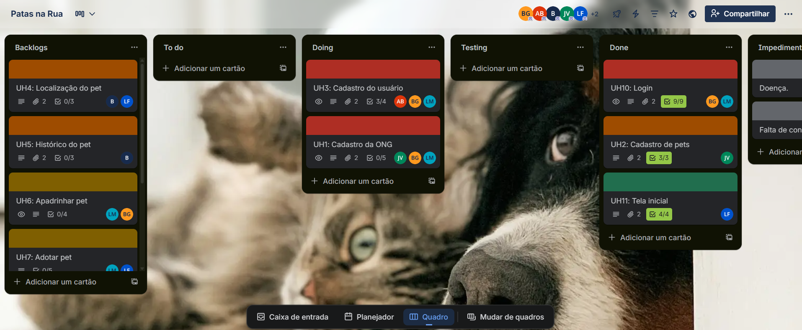
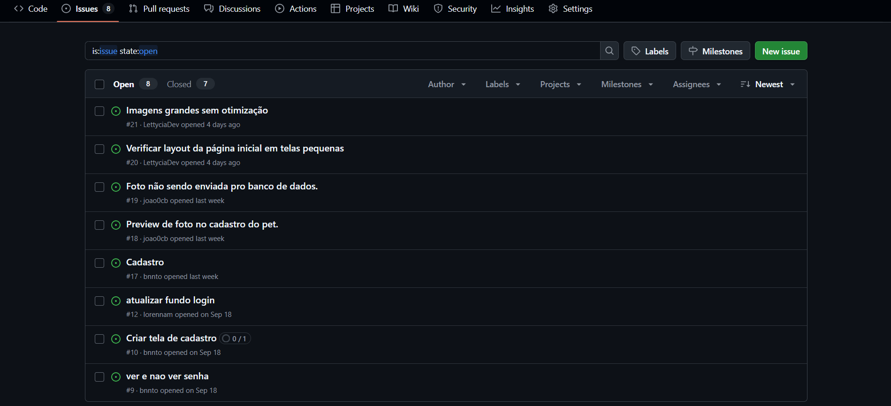
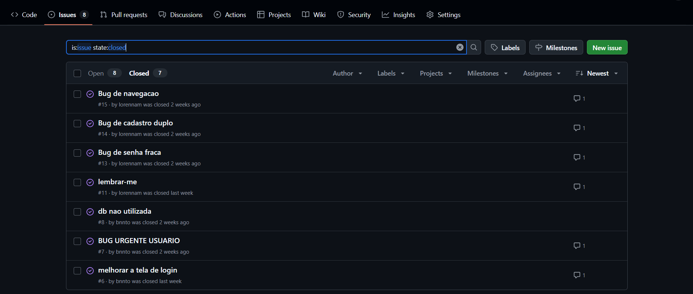

# Patas na Rua

**Equipe:**
- [Anna Beatriz dos Santos Silva](https://github.com/Anninhaxs) (Front-End)
- [Bento Guilherme Gomes Oliveira](https://github.com/bnnto) (Back-End)
- [Bruno Ferreira de Andrade Lyra](https://github.com/BrunoFerreiraLyra) (Back-End)
- [João Victor Castelo Branco de Sena](https://github.com/joao0cb) (Back-End)
- [Lettycia Vitoria Melo de França](https://github.com/LettyciaDev) (Back-End)
- [Lorenna Meneses de Almeida](https://github.com/lorennam) (Front-End)

---
# Aplicação Web de Rastreamento de Animais de Rua

## Visão Geral
Muitas ONGs enfrentam um desafio crítico: a **falta de espaço** para acolher todos os cães e gatos abandonados nas ruas. Sem proteção, esses animais ficam vulneráveis. Nosso projeto propõe uma solução: **coleiras com rastreadores** que permitem monitorar a localização desses animais em tempo real através de um site dedicado.

Com essa tecnologia, as ONGs podem:
- **Gerenciar cuidados** aos animais não abrigados.
- Facilitar o **apadrinhamento**, permitindo que pessoas se responsabilizem financeiramente, mesmo à distância.
- **Apoiar adoções**, conectando animais rastreados a possíveis adotantes.

## Objetivo
Proteger e melhorar a qualidade de vida de animais de rua, oferecendo uma solução tecnológica que:
- **Reduz o abandono** ao monitorar e cuidar de animais fora dos abrigos.
- **Amplia o alcance das ONGs**, conectando-as com a comunidade para apadrinhamento e adoção.
- **Facilita a localização** desses animais.

## Como Funciona?
1. **Rastreamento**: Animais de rua recebem coleiras com rastreadores GPS.
2. **Monitoramento**: A localização é exibida para a instituição em tempo real em um site acessível.
3. **Gestão de Cuidados**: ONGs acompanham os animais e organizam apadrinhamentos e adoções.
4. **Adoção Facilitada**: Pessoas podem apadrinhar e adotar animais rastreados.

## Impacto Esperado
- **Animais protegidos**, mesmo sem espaço nas ONGs.
- **Comunidade engajada** no apadrinhamento e adoção.
- **Redução do abandono** e melhoria na qualidade de vida animal.

# Trello

Link para visualizar o trello: [Trello](https://trello.com/b/Zv0x8ntW/patas-na-rua)

### Quadro Atualizado

### Quadro Antigo

[Quadro Antigo](https://drive.google.com/drive/folders/1Jqr3Yn5fIHLeY4F4NfSvS09Uc6fM1N4T?usp=drive_link)

### Backlog

# Figma

Link para visualizar o figma do projeto: [Patas na Rua](https://www.figma.com/design/v7vz9nH8jlqldcBGe8qKIp/PatasNaRuaVisu?node-id=0-1&t=kICA12GHyYwpdJoW-1)

# Screencast

- Link para demonstração das funcionalidades do projeto: [Screencast](https://drive.google.com/drive/folders/1X9eKB9kNdjSjooO-u2W0E6FK_3Dyimkk?usp=drive_link)
- Link para demonstração das 3 histórias prontas: [Screencast 3 histórias](https://drive.google.com/drive/folders/164AVSKDCRmPMgvYiycS_o05gstkSsWAT?usp=drive_link)

# Diagramas de Atividades

# Issue/Bug Tracker Atualizada

## Issues Fechadas

# Storyboards

- **Tela da ONG (Cadastrar Pet)**
1. ONG acessa a tela de Cadastrar Pet → aparece formulário.
2. ONG preenche os dados do pet → nome, idade, raça etc.
3. ONG clica em Concluir → sistema valida as informações.
4. Sistema salva no banco de dados → exibe mensagem de confirmação.

- **Tela da ONG (Exibir Informações do Pet)**

1. ONG entra na tela de Pets → opções de pesquisa ou lista de pets.
2. ONG pesquisa um pet → sistema verifica.
3. Pet não encontrado → sistema mostra mensagem de erro.
4. Pet encontrado → sistema exibe informações completas do pet.

- **Tela do Usuário (Exibir Informações do Pet)**

1. Usuário acessa a tela de Pets → vê a lista de animais.
2. Usuário pesquisa um pet → sistema verifica.
3. Pet não encontrado → sistema mostra mensagem de erro.
4. Pet encontrado → sistema exibe informações completas do pet.
5. Usuário também pode clicar em um pet já listado → sistema abre informações.

- **Tela de Login**

1. Tela de login → aparece o formulário de login.
2. Pessoa insere dados → pessoa digita seu e-mail e senha.
3. Banco de dados valida as credenciais → o sistema verifica os dados, se sim segue para tela correspondente, se não aparece erro.

- **Tela de Cadastro**

1. Tela inicial → pessoa escolhe entre Usuário e ONG.
2. Se Usuário → formulário de cadastro é exibido.
3. Usuário preenche dados → sistema armazena e criptografa no banco de dados.
4. Cadastro bem-sucedido → usuário é direcionado para a tela inicial do site.
5. Erro no cadastro → sistema exibe mensagem de erro.
6. Se ONG → formulário de cadastro da ONG é exibido.
7. Funcionário preenche formulário principal → completa mini formulário com informações gerais da ONG.
8. Sistema armazena e criptografa dados → solicitação de cadastro é enviada para análise.
9. Solicitação aprovada → ONG é direcionada para a tela inicial do site.
10. Solicitação reprovada → sistema envia e-mail de reprovação para o responsável da ONG.

# Relatório Pair Programming

Nosso Pair Programming nos possibilitou aprender ainda mais um com o outro, enquanto um programava o outro observava, ou fazia outras coisas do projeto. Os pontos fortes são a parceria e a troca de ideias, o que faz a programação ser ainda mais fácil e divertida. Já os pontos fracos, na verdade, o nosso único ponto fraco, é a divergência de ideias, mas isso pode ser resolvido facilmente. Resumindo, pair programming é uma otíma prática, para colegas, amigos, namorados, ou até conhecidos, pois de toda forma, ambos aprenderão ainda mais juntos. 

-Lorenna e Bento.
